# 모바일 프로그래밍 개인 과제
2022년 모바일 프로그래밍\
20213038 이보현 개인과제

---
## 개발 환경
Android Studio Dolphin | 2021.3.1 Patch 1 \
Pixel 2 API 31 (실행 시, 다른 AVD 사용 가능)

## 애플리케이션 버전
`minSdk 21` \
`targetSdk 32`

## 설치 방법
- Github repository 에서 master branch를 clone
- ecampus에 올라가있는 소스 압축 파일을 다운\
-> Android Studio IDE를 통해 실행

## 실행 시 유의 사항
- 회원 정보는 Preferences를 통해 저장됩니다.\
회원 정보 변경 혹은 삭제를 하고 싶다면, 다음 경로의 xml 파일을 수정해 주시기 바랍니다.
```
data/data/com.example.assignment/shared_prefs
```
- 에뮬레이터에서 한글 키보드를 이용하고자 하는 경우,\
각 에뮬레이터 기기의 설정에서 언어 "한국어"를 추가해 주셔야 합니다. 

---
## 애플리케이션 상세 설명
해당 애플리케이션은 로그인, 회원가입, 상품 페이지로 구성되어 있습니다.

### 1. 로그인
```
Relativelayout으로 구성된 화면입니다.  
사용자로부터 아이디와 비밀번호를 입력받습니다.  
입력된 아이디로 Preferences를 가져오며, 이를 이용해 아이디와 비밀번호를 판단합니다.  
입력된 아이디가 존재하지 않거나, 비밀번호가 해당 아이디와 맞지 않을 경우  
로그인 버튼 클릭 시, 경고문을 노출하고 로그인은 되지 않습니다.  
기존에 가입한 아이디와 그에 맞는 비밀번호가 들어왔을 경우
로그인 버튼 클릭 시,  로그인과 함께 상품 페이지로 이동합니다.  
하단의 회원가입, 바로 시작을 클릭 시 각각 회원가입, 상품페이지로 이동합니다.  
```
### 2. 회원가입
```
크게는 Linearlayout을 사용하고 있으며  
헤더 부분은 Framelayout, 본문은 Scrollview을 통해 화면을 구성하였습니다.
상단의 화살표 클릭 시, 로그인으로 이동합니다.
아이디는 영어 소문자와 숫자만 입력 가능하며, 중복 확인은 필수로 요구됩니다.
아이디 중복일 경우, 경고문을 표시합니다.
비밀번호는 정규식을 사용해 8-12자 & 영문 숫자 특수문자(@$!%*#?.) 중 2가지 이상으로 제한합니다.
조건에 맞지 않을 시 경고문을 표시합니다.
모든 입력과 조건이 충족됐을 경우에만 회원가입 버튼이 활성화됩니다.
```

### 3. 상품페이지
```
전체 화면은 Linearlayout을 사용하며, 헤더는 Framelayout, 하단은 RecyclerView와 함께 Linearlayout으로 화면을 구성하고 있습니다.
상단의 화살표 클릭 시, 로그인으로 이동합니다.
회원정보 아이콘 클릭 시, 로그인 상태에 따라 회원 정보 또는 회원가입 유도 Dialog를 띄워줍니다.
아이템의 사진을 누르면 해당 아이템이 삭제됩니다.
상품의 추가는 하단의 입력창과 버튼을 통해 이루어집니다.
이미지명은 애플리케이션에 담아둔 6가지 사진의 이름만 작성 가능하며,
적절하지 않은 입력이 들어왔을 경우 혹은 상품명을 적지 않았을 경우에는 경고문을 띄우며 추가되지 않습니다.
```
---
### 실행 모습
<br>
- 로그인
<div>
    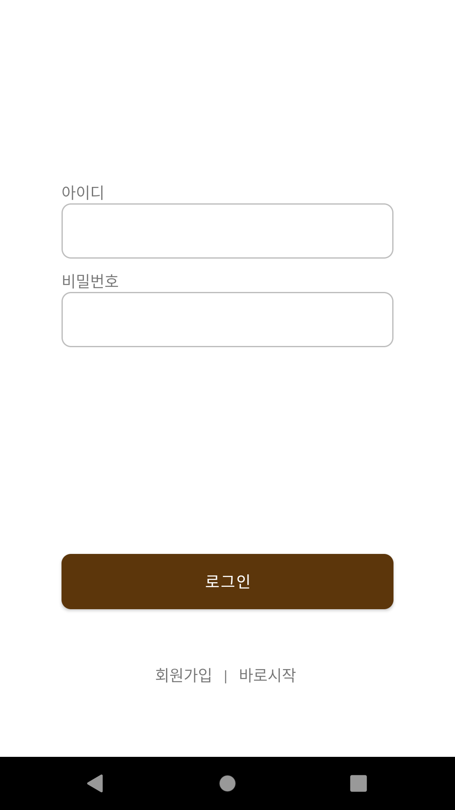
    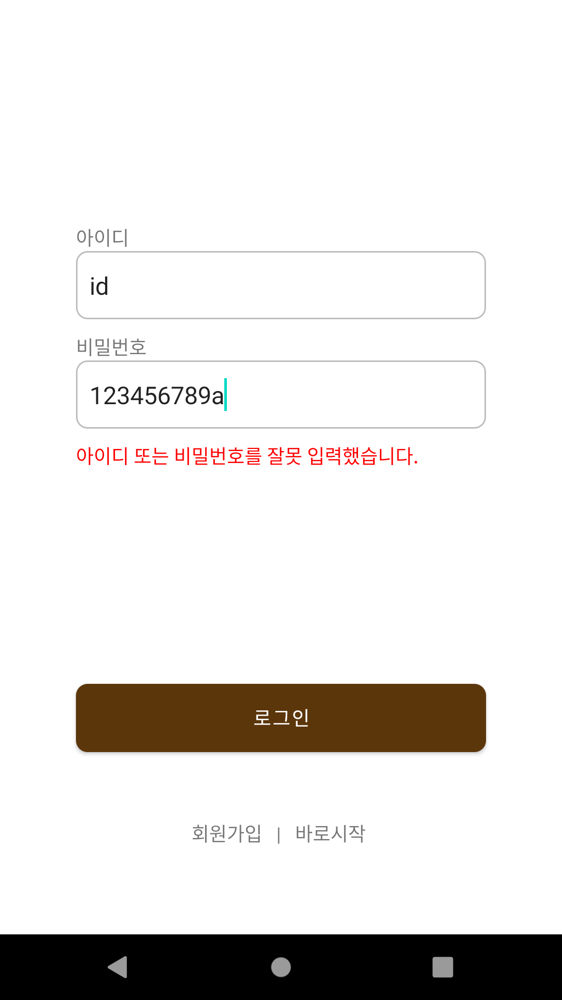
</div>
<br>
- 아이디 중복 & 비밀번호 조건 확인
<div>
    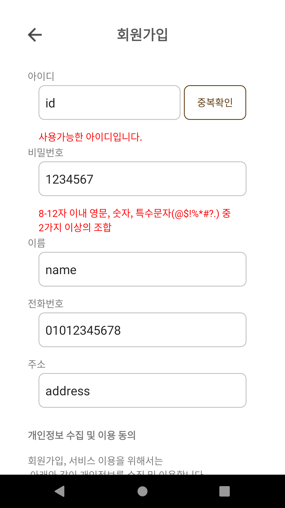
    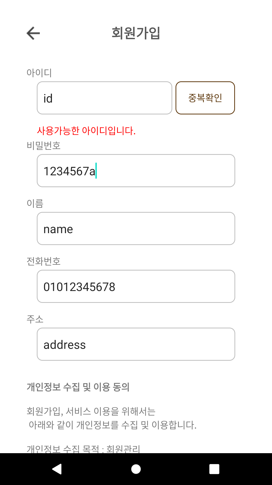
    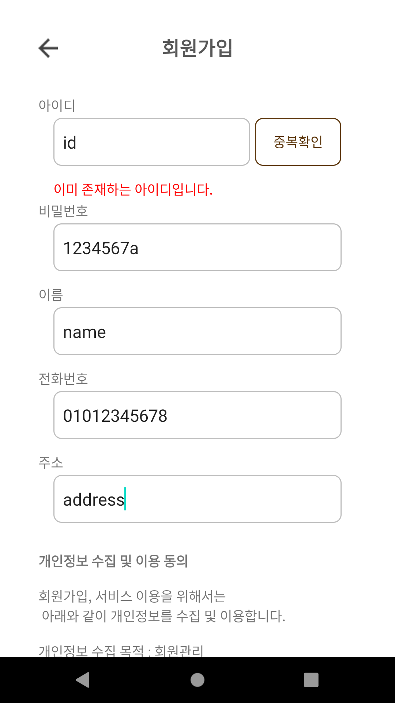
</div>
<br>
- 회원가입 버튼 활성화
<div>
    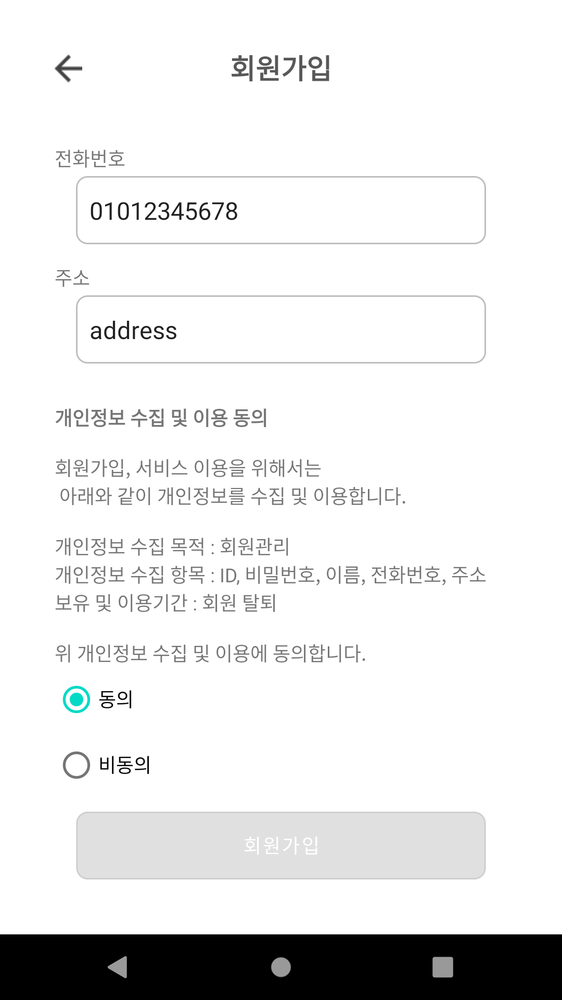
    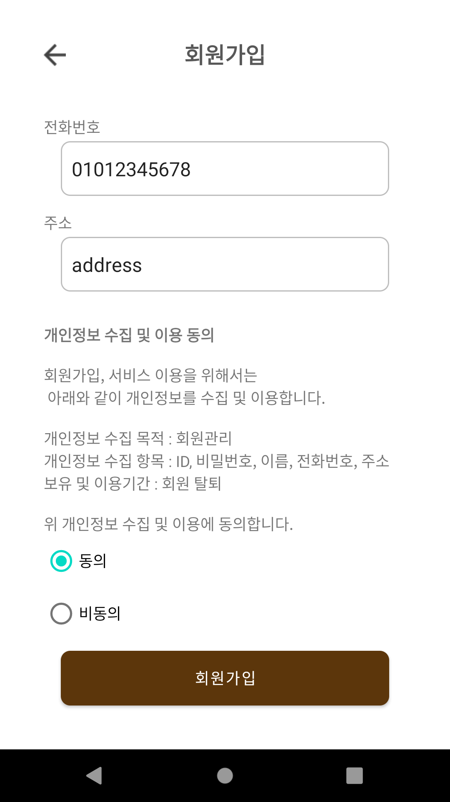
</div>
<br>
- 회원정보
<div>
    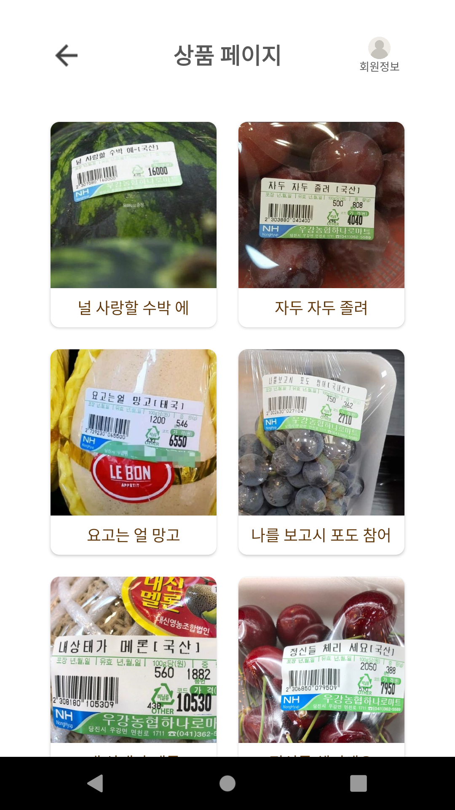
    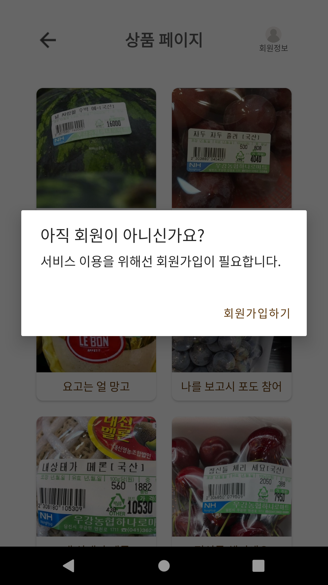
    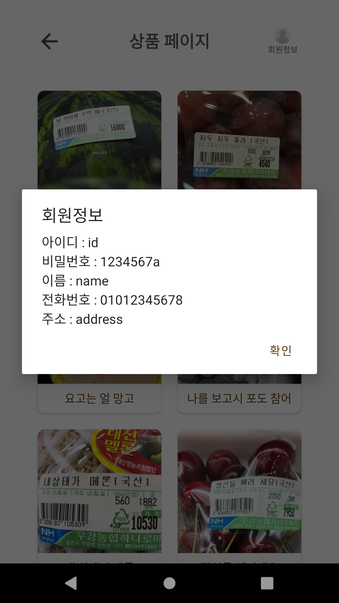
</div>  
<br>
- 상품 삭제 & 추가
<div>
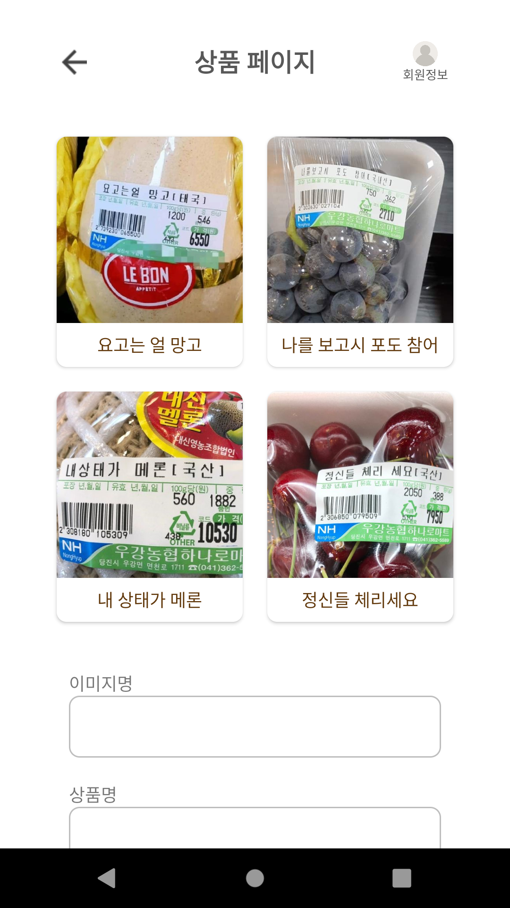
    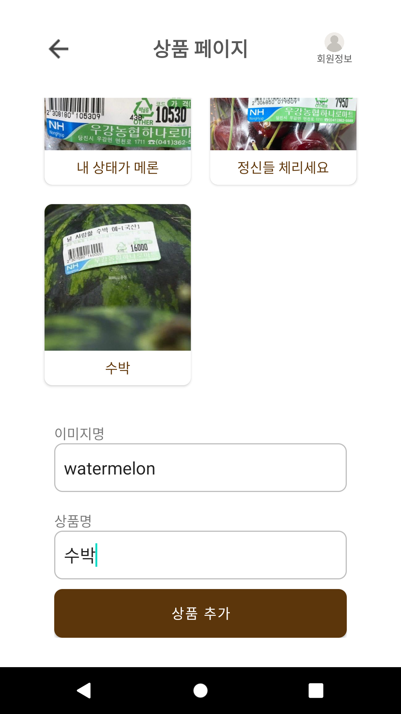
    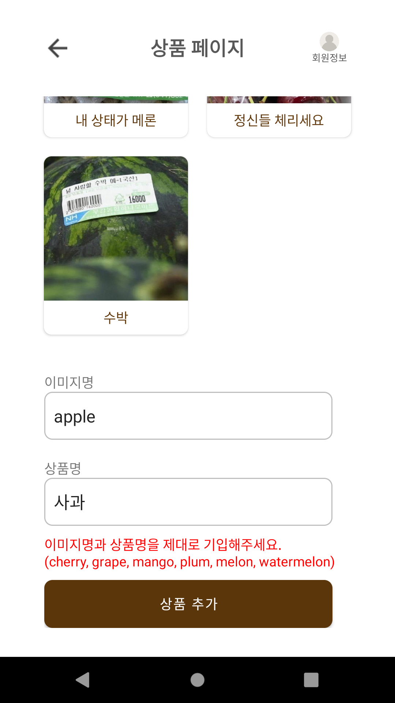
</div>


